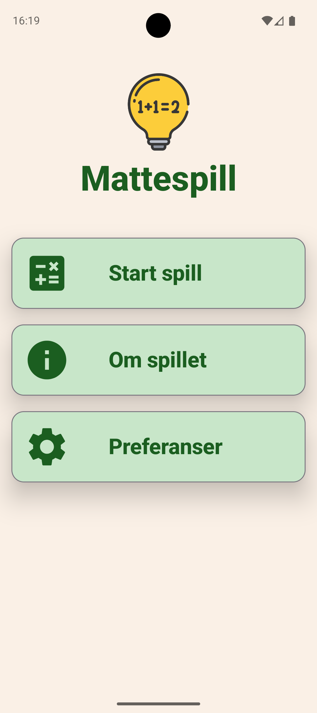
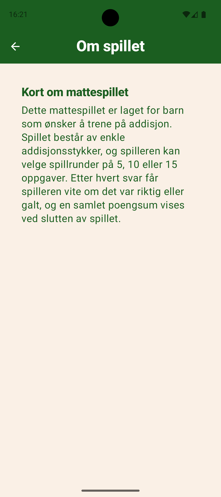
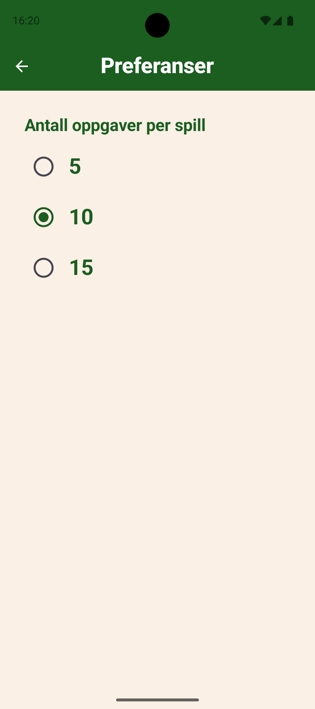

# Mappe 1 – Addisjonsspill for barn

En matteopplæringsapplikasjon for barn utformet som et addisjonsspill der brukeren skal løse tilfeldig utvalgte regnestykker ved ved å skrive inn svar med talknapper i grensesnittet. Det kan velges mellom spilløkter på 5, 10 eller 15 oppgaver, og hver oppgave vises kun én gang per runde.

Spillet har 15 regnestykker tilgjengelig, som ligger i en xml fil under res/values. Antall oppgaver per spilløkt kan endres i preferanser, og brukerens valg lagres i SharedPreferences slik at innstillingen huskes mellom økter.

Applikasjonen støtter både norsk og tysk språk.
## Skjermbilder og demo

| **Startskjerm** | **Om spillet** | **Preferanser** |
|-----------------|----------------|-----------------|
|  |  |  | 

**Demo av spill**

https://github.com/user-attachments/assets/d653b052-f828-4905-aa78-63b13d2c239d 

