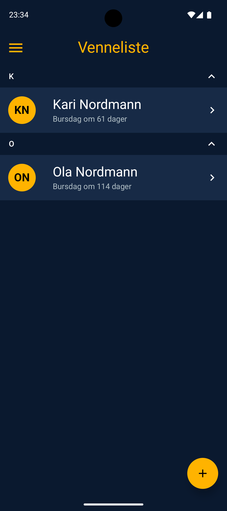
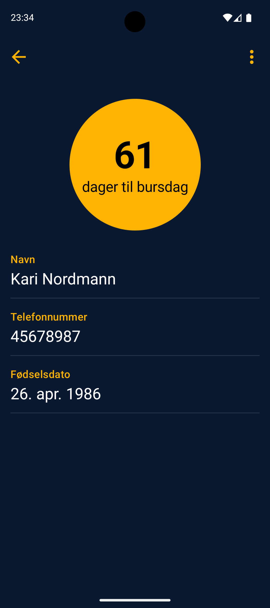
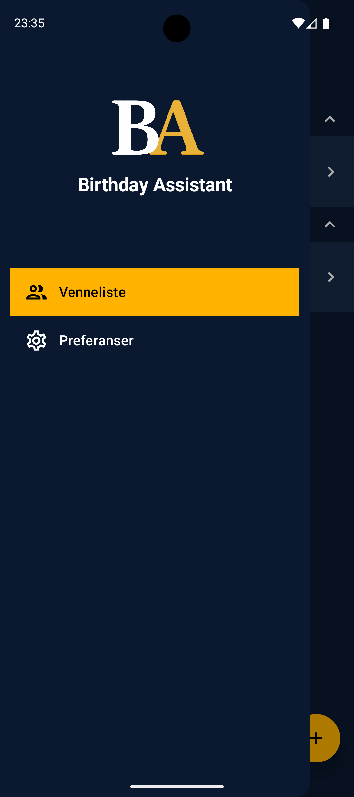
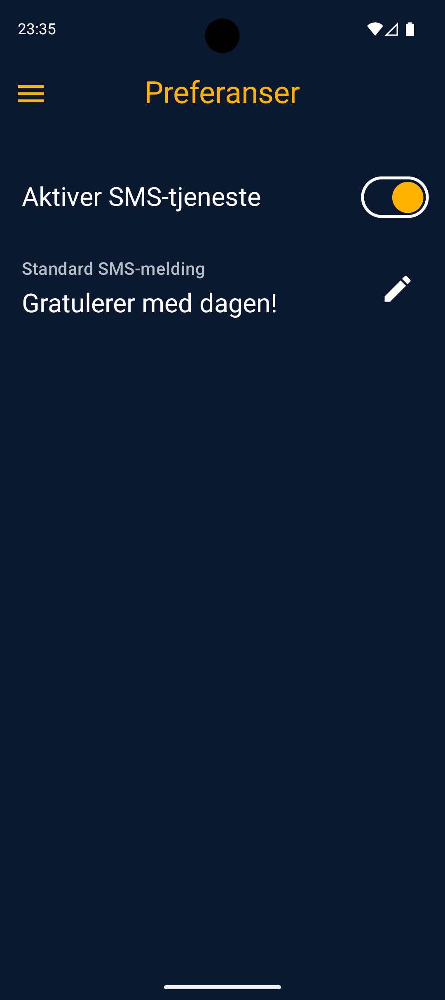

# Mappe 2 – Bursdagsassistent
En applikasjon hvor brukeren kan registrere venner og holde oversikt over deres fødselsdager. Venner registreres med navn, telefonnummer og fødselsdato og lagres i en lokal SQLite-database via ROOM. Alle registrerte venner vises i en liste ved oppstart, og det er mulig å endre eller slette venner.

Appen har en SMS-tjeneste som automatisk sender bursdagshilsener til venner som har bursdag. Tjenesten styres av WorkManager, som daglig sjekker for bursdager og sender SMS til dem det gjelder.
SMS-tjenesten kan aktiveres/deaktiveres i preferanser. Der kan også standardmelding som skal sendes endres.

## Skjermbilder
| **Startskjerm** | **Registrering** | **Vennedetaljer** |
|-----------------|------------------|-------------------|
|  |  |  |

| **Meny** | **Preferanser** |
|----------|------------------|
|  |  |

