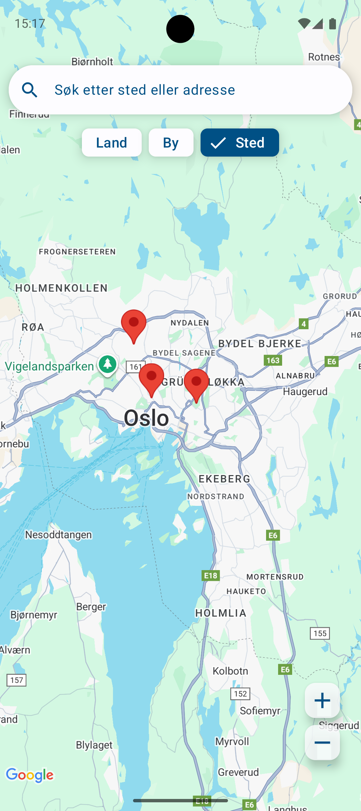
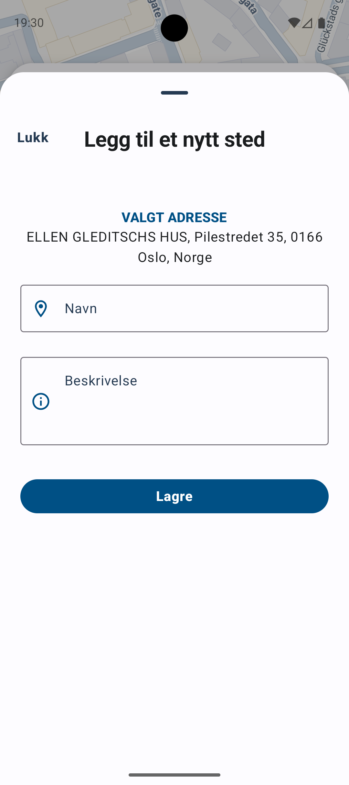
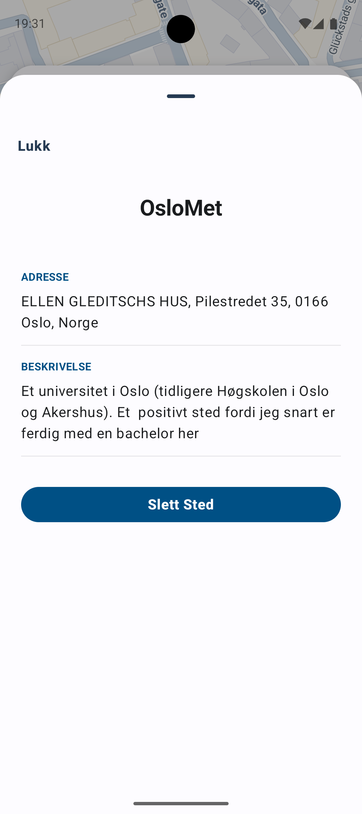
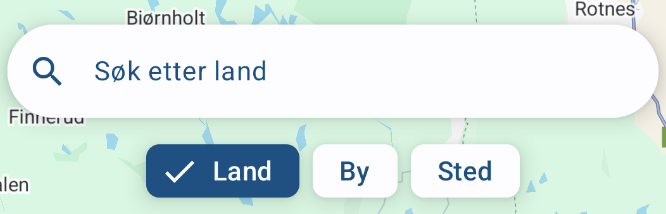
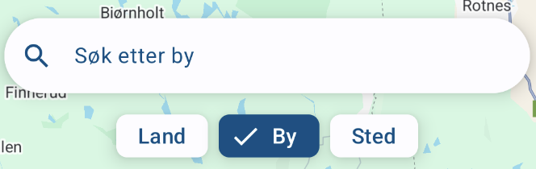
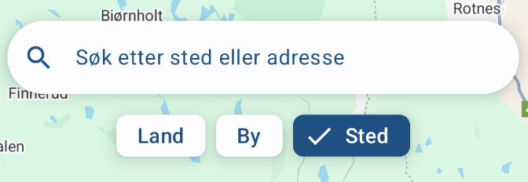

# Mappe 3 – Kartbasert favorittstedsapplikasjon
En kartapplikasjon som lar brukeren registrere sine favorittsteder i et interaktivt Google Maps-kart. Nye steder legges til ved å trykke direkte på kartet, som åpner et registreringsskjema i en BottomSheet der brukeren kan fylle inn navn og beskrivelse. For hvert registrerte sted lagres navn, beskrivelse, gateadresse og GPS-koordinater. Stedene lagres i en ekstern MariaDB-database. Registrerte steder vises som markører på kartet, og ved å trykke på en markør får brukeren opp en BottomSheet med lagret informasjon om stedet. Appen har også et søkefelt som lar brukeren søke etter land, byer, attraksjoner eller adresser for å navigere kartet direkte til ønsket sted.

Androids Geocoder benyttes til å oversette mellom koordinater og adresser i søk og registrering av steder. All datautveksling mellom applikasjonen og den eksterne MariaDB-databasen skjer via en webtjeneste. Denne håndterer lagring, henting og sletting av steder ved bruk av Retrofit, mens Moshi brukes for å konvertere mellom JSON-data og Kotlin-objekter. Databasen er hostet på OsloMet sine servere, og tilkobling krever VPN utenfor OsloMet sitt nettverk.

## Skjermbilder 
| **Kart med favorittsteder markert** | **Registrering av sted** | **Stedsinformasjon** |
|-------------------------------------|--------------------------|----------------------|
|  |  |  |

| **Søkefelt** |
|--------------|
|   
  
 |